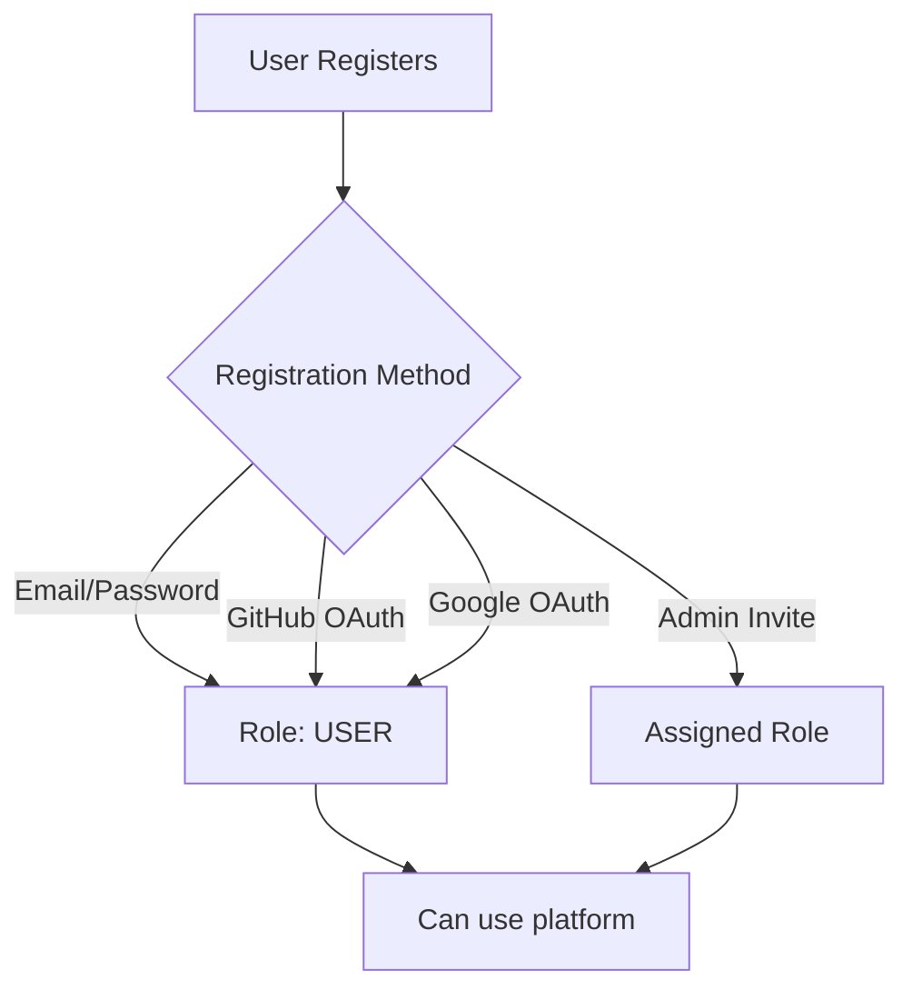

<div align="center">

# 🚀 OmniStack

### The Developer Operating System

**Any Stack. Any Cloud. Your Rules.**

[](https://nextjs.org/)
[](https://www.typescriptlang.org/)
[](https://tailwindcss.com/)
[](https://ui.shadcn.com/)
[](LICENSE)

[Demo](#-demo) • [Features](#-complete-feature-matrix) • [Role System](#-role-system--access-control) • [Quick Start](#-quick-start) • [Roadmap](#️-roadmap)

</div>

---

## 📖 Tentang OmniStack

**OmniStack** adalah *Developer Operating System (DevOS)* — platform **PaaS (Platform as a Service) modern** yang menyatukan **Cloud IDE**, **AI Prompt Engineer**, **CI/CD Pipeline**, **Container Orchestration**, dan **Observability** dalam satu antarmuka yang elegan.

Berbeda dengan:
- ❌ **PaaS tradisional** (Vercel, Heroku, Railway) yang mahal & vendor lock-in
- ❌ **Control Panel kuno** (cPanel, CyberPanel, Plesk) yang manual & terbatas
- ❌ **Self-hosted PaaS** (Coolify, Dokploy) yang single-node & minim fitur

OmniStack menggunakan model **Bring Your Own Cloud (BYOC)** — Anda membawa VPS sendiri (Hetzner, AWS, DigitalOcean, IDCloudHost, Biznet), kami yang mengorkestrasinya menjadi platform kelas enterprise.

---

## 🎭 Role System & Access Control

OmniStack menggunakan **Role-Based Access Control (RBAC)** dengan 3 level untuk MVP. Setiap role memiliki permission yang jelas dan terukur.

### 👥 Overview Roles

| Role | Icon | Level | Use Case | Default After Registration |
|------|------|-------|----------|---------------------------|
| **ADMIN** | 👑 | Super User | Founder, CTO, DevOps Engineer | ❌ No (manual assign) |
| **USER** | 👨‍💻 | Standard | Developer, Indie Hacker, Team Member | ✅ Yes |
| **VIEWER** | 👁️ | Read-Only | Product Manager, Client, Auditor | ❌ No (manual assign) |

---

### 👑 ADMIN — Super Administrator

**Definisi:** Pengguna dengan akses penuh ke seluruh sistem. Bertanggung jawab atas manajemen user, konfigurasi sistem, dan pengawasan global.

#### ✅ Permissions (What They Can Do)

| Category | Actions |
|----------|---------|
| **User Management** | Create, Read, Update, Delete semua user |
| **Role Management** | Promote/demote role user lain |
| **Project Access** | Akses semua proyek dari semua user |
| **System Settings** | Kelola SMTP, OAuth providers, API keys global |
| **Audit & Logs** | View audit logs, system metrics, error reports |
| **Deployments** | Deploy/rollback semua proyek di sistem |
| **Dangerous Actions** | Hapus user/proyek secara permanen |
| **Billing** | View & manage subscription, invoices |

#### ❌ Restrictions (What They Cannot Do)
- Bypass 2FA jika di-enable
- Delete their own account (harus via super-admin lain)

#### 🎯 Use Case
- Founder/CTO startup yang butuh kontrol penuh
- DevOps Engineer di software house
- System Administrator enterprise
- Solo developer yang mengelola semua aspek

#### 🧪 Test Account
```bash
Email:    admin@omnistack.dev
Password: admin123
```

#### 📍 Post-Login Destination
- **Redirect:** `/admin` (Admin Dashboard)
- **First View:** User statistics, system health, recent activities

---

### 👨‍💻 USER — Standard Developer

**Definisi:** Developer yang dapat mengelola proyek dan deployment miliknya sendiri. Role default untuk sebagian besar pengguna.

#### ✅ Permissions (What They Can Do)

| Category | Actions |
|----------|---------|
| **Own Projects** | CRUD proyek miliknya sendiri |
| **Deployments** | Deploy, rollback, view logs proyek sendiri |
| **Collaboration** | Invite kolaborator ke proyeknya |
| **Profile** | Edit profile, API keys pribadi, preferences |
| **AI Features** | Gunakan AI Architect untuk generate code |
| **GitOps** | Create preview environments per PR |
| **Monitoring** | View metrics & logs proyek sendiri |
| **FinOps** | View cost tracking proyek sendiri |

#### ❌ Restrictions (What They Cannot Do)
- Akses proyek user lain (kecuali di-invite sebagai collaborator)
- Manage users atau system settings
- View audit logs global
- Delete user lain
- Modify subscription/billing

#### 🎯 Use Case
- Full-stack developer dalam tim
- Indie hacker dengan side projects
- Mahasiswa/intern yang sedang belajar
- Freelancer yang kelola proyek klien

#### 🧪 Test Account
```bash
Email:    dev@omnistack.dev
Password: dev123
```

#### 📍 Post-Login Destination
- **Redirect:** `/dashboard` (Personal Dashboard)
- **First View:** My projects, recent deployments, AI Architect quick access

---

### 👁️ VIEWER — Read-Only Observer

**Definisi:** Pengguna yang hanya bisa memantau dan melihat data tanpa bisa melakukan perubahan. Cocok untuk stakeholder non-teknis.

#### ✅ Permissions (What They Can Do)

| Category | Actions |
|----------|---------|
| **Dashboards** | View semua dashboard & metrics |
| **Logs & Monitoring** | Read deployment logs, APM data |
| **Reports** | View & download FinOps reports (CSV/PDF) |
| **Projects** | View (read-only) proyek yang di-share ke mereka |
| **Alerts** | Receive notifications (read-only) |
| **Profile** | Edit profile pribadi |

#### ❌ Restrictions (What They Cannot Do)
- Create, edit, atau delete apapun
- Deploy atau rollback aplikasi
- Invite user atau collaborator
- Ubah settings (system atau project)
- Execute AI Architect untuk generate code
- Access SSH atau terminal

#### 🎯 Use Case
- Product Manager yang monitor progress
- Client/stakeholder yang ingin lihat status
- Auditor compliance yang perlu observasi
- Investor yang monitor burn rate
- QA yang hanya perlu observasi tanpa eksekusi
- Trainer/mentor yang melihat progress student

#### 🧪 Test Account
```bash
Email:    viewer@omnistack.dev
Password: viewer123
```

#### 📍 Post-Login Destination
- **Redirect:** `/dashboard` (Read-Only Dashboard)
- **First View:** Metrics overview, monitoring dashboards, reports

---

### 🔐 Permission Matrix (Detail)

| Feature / Action | 👑 ADMIN | 👨‍💻 USER | 👁️ VIEWER |
|------------------|:--------:|:--------:|:----------:|
| **User Management** | | | |
| View all users | ✅ | ❌ | ❌ |
| Create new user | ✅ | ❌ | ❌ |
| Edit user role | ✅ | ❌ | ❌ |
| Delete user | ✅ | ❌ | ❌ |
| **Project Management** | | | |
| View all projects | ✅ | ❌ | ❌ |
| View own projects | ✅ | ✅ | ⚠️ Shared only |
| Create project | ✅ | ✅ | ❌ |
| Edit project | ✅ | ✅ Own | ❌ |
| Delete project | ✅ | ✅ Own | ❌ |
| **Deployment** | | | |
| Deploy any project | ✅ | ❌ | ❌ |
| Deploy own project | ✅ | ✅ | ❌ |
| Rollback deployment | ✅ | ✅ Own | ❌ |
| View deployment logs | ✅ | ✅ Own | ✅ Shared |
| **AI Features** | | | |
| Use AI Architect | ✅ | ✅ | ❌ |
| Use AI Code Reviewer | ✅ | ✅ | ❌ |
| View AI history | ✅ | ✅ Own | ❌ |
| **GitOps** | | | |
| Connect Git provider | ✅ | ✅ | ❌ |
| Create preview env | ✅ | ✅ | ❌ |
| View preview env | ✅ | ✅ | ✅ Shared |
| **Infrastructure** | | | |
| Add VPS node | ✅ | ❌ | ❌ |
| Manage clusters | ✅ | ❌ | ❌ |
| View cluster health | ✅ | ✅ | ✅ |
| **Monitoring** | | | |
| View APM | ✅ | ✅ Own | ✅ Shared |
| View logs | ✅ | ✅ Own | ✅ Shared |
| View FinOps | ✅ | ✅ Own | ✅ Shared |
| Export reports | ✅ | ✅ Own | ✅ Shared |
| **Settings** | | | |
| System settings | ✅ | ❌ | ❌ |
| Profile settings | ✅ | ✅ | ✅ |
| Project settings | ✅ | ✅ Own | ❌ |
| **Security** | | | |
| View audit logs | ✅ | ❌ | ❌ |
| Manage API keys (global) | ✅ | ❌ | ❌ |
| Manage API keys (own) | ✅ | ✅ | ❌ |
| Enable/disable 2FA (others) | ✅ | ❌ | ❌ |

**Legend:**
- ✅ = Full access
- ❌ = No access
- ⚠️ = Conditional access (requires sharing)
- "Own" = Only for resources they own
- "Shared" = Only for resources shared with them

---

### 🛣️ Route Access Map

| Route | ADMIN | USER | VIEWER | Public |
|-------|:-----:|:----:|:------:|:------:|
| `/` (Landing) | ✅ | ✅ | ✅ | ✅ |
| `/login` | ✅ | ✅ | ✅ | ✅ |
| `/register` | ✅ | ✅ | ✅ | ✅ |
| `/pricing` | ✅ | ✅ | ✅ | ✅ |
| `/dashboard` | ✅ | ✅ | ✅ (RO) | ❌ |
| `/projects` | ✅ (all) | ✅ (own) | ✅ (shared) | ❌ |
| `/projects/:id` | ✅ | ✅ (own) | ✅ (shared) | ❌ |
| `/ai-architect` | ✅ | ✅ | ❌ | ❌ |
| `/ai-reviewer` | ✅ | ✅ | ❌ | ❌ |
| `/deployments` | ✅ (all) | ✅ (own) | ✅ (shared) | ❌ |
| `/monitoring` | ✅ | ✅ | ✅ (RO) | ❌ |
| `/error-tracking` | ✅ | ✅ | ✅ (RO) | ❌ |
| `/gitops` | ✅ | ✅ | ❌ | ❌ |
| `/finops` | ✅ | ✅ (own) | ✅ (shared, RO) | ❌ |
| `/settings` | ✅ | ✅ (profile) | ✅ (profile) | ❌ |
| `/admin` | ✅ | ❌ | ❌ | ❌ |
| `/admin/users` | ✅ | ❌ | ❌ | ❌ |
| `/admin/databases` | ✅ | ❌ | ❌ | ❌ |
| `/admin/audit` | ✅ | ❌ | ❌ | ❌ |
| `/admin/settings` | ✅ | ❌ | ❌ | ❌ |
| `/admin/infrastructure` | ✅ | ❌ | ❌ | ❌ |
| `/admin/ai-config` | ✅ | ❌ | ❌ | ❌ |
| `/admin/billing` | ✅ | ❌ | ❌ | ❌ |
| `/api/*` | ✅ | ✅* | ✅* | ❌ |

**Legend:**
- RO = Read-Only
- `*` = Limited to own resources

> **Catatan:** Semua halaman di atas masih mock UI — belum ada backend.
> Pembatasan akses VIEWER diimplementasikan di sidebar (`app-sidebar.tsx`
> menyembunyikan item) dan helper RBAC di `lib/mock-data.ts`.

---

### 🎨 UI/UX Differences per Role

#### Sidebar Navigation

Sidebar diimplementasikan di `components/app-sidebar.tsx` dengan 3 grup:
**Workspace** (semua role, item bervariasi per role), **Administrasi**
(hanya ADMIN), dan **Akun** (semua role). Header menampilkan identitas role
(👑 Administrator amber · 👨‍💻 Developer blue · 👁️ Viewer emerald).
Khusus VIEWER ada footer "Read-only mode".

**👑 ADMIN Sidebar:**
```
┌──────────────────────────────┐
│ OmniStack                    │
│ 👑 Administrator             │
├──────────────────────────────┤
│ Workspace                    │
│  🏠 Overview        → /admin │
│  📦 All Projects    → /projects │
│  🚀 Deployments     → /deployments │
│  📊 Monitoring      → /monitoring │
│  🐛 Error Tracking  → /error-tracking │
│  🔀 Preview Env     → /gitops │
│  💰 FinOps          → /finops │
│  ✨ AI Architect    → /ai-architect │
│  🧠 AI Code Reviewer→ /ai-reviewer │
├──────────────────────────────┤
│ Administrasi   ← ADMIN ONLY  │
│  👥 User Management → /admin/users │
│  🗄️ Databases       → /admin/databases │
│  📋 Audit Logs      → /admin/audit │
│  ⚙️ System Settings → /admin/settings │
│  🖥️ Infrastructure  → /admin/infrastructure │
│  🤖 AI Config       → /admin/ai-config │
│  💳 Billing         → /admin/billing │
├──────────────────────────────┤
│ Akun                         │
│  ⚙️ Settings        → /settings │
└──────────────────────────────┘
```

**👨‍💻 USER Sidebar:**
```
┌──────────────────────────────┐
│ OmniStack                    │
│ 👨‍💻 Developer                │
├──────────────────────────────┤
│ Workspace                    │
│  🏠 Overview        → /dashboard │
│  📦 My Projects     → /projects │
│  🚀 Deployments     → /deployments │
│  📊 Monitoring      → /monitoring │
│  🐛 Error Tracking  → /error-tracking │
│  🔀 Preview Env     → /gitops │
│  💰 FinOps          → /finops │
│  ✨ AI Architect    → /ai-architect │
│  🧠 AI Code Reviewer→ /ai-reviewer │
├──────────────────────────────┤
│ Akun                         │
│  ⚙️ Settings        → /settings │
└──────────────────────────────┘
```

**👁️ VIEWER Sidebar:**
```
┌──────────────────────────────┐
│ OmniStack                    │
│ 👁️ Viewer                    │
├──────────────────────────────┤
│ Workspace                    │
│  🏠 Overview (RO)   → /dashboard │
│  📦 Shared Projects → /projects │
│  🚀 Deployments     → /deployments │
│  📊 Monitoring      → /monitoring │
│  🐛 Error Tracking  → /error-tracking │
│  💰 FinOps          → /finops │
│  ❌ Preview Env     → disembunyikan │
│  ❌ AI Architect    → disembunyikan │
│  ❌ AI Code Reviewer→ disembunyikan │
├──────────────────────────────┤
│ Akun                         │
│  ⚙️ Settings        → /settings │
├──────────────────────────────┤
│ 👁️ Read-only mode            │
│  Semua tombol aksi           │
│  dinonaktifkan.              │
└──────────────────────────────┘
```

**Perbedaan kunci antar role:**

| Item | ADMIN | USER | VIEWER |
|------|:-----:|:----:|:------:|
| Overview mengarah ke | `/admin` | `/dashboard` | `/dashboard` |
| Label menu Projects | All Projects | My Projects | Shared Projects |
| Preview Environments (`/gitops`) | ✅ | ✅ | ❌ Disembunyikan |
| AI Architect & AI Code Reviewer | ✅ | ✅ | ❌ Disembunyikan |
| Grup Administrasi (7 item admin) | ✅ | ❌ | ❌ |
| Footer "Read-only mode" | ❌ | ❌ | ✅ |

#### Button States

| Action Button | ADMIN | USER | VIEWER |
|---------------|:-----:|:----:|:------:|
| "Create Project" | ✅ Enabled | ✅ Enabled | ❌ Hidden |
| "Deploy" | ✅ Enabled | ✅ Enabled (own) | ❌ Disabled |
| "Rollback" | ✅ Enabled | ✅ Enabled (own) | ❌ Disabled |
| "Delete" | ✅ Enabled (red) | ✅ Enabled (own, red) | ❌ Hidden |
| "Invite User" | ✅ Enabled | ✅ Enabled (project) | ❌ Hidden |
| "Export Report" | ✅ Enabled | ✅ Enabled | ✅ Enabled |
| "Run AI Prompt" | ✅ Enabled | ✅ Enabled | ❌ Disabled |

---

### 🧪 Testing the Roles

#### Quick Test Flow

**1. Test ADMIN Access:**
```bash
# Login
Email: admin@omnistack.dev
Password: admin123

# Expected behavior:
✅ Redirect to /admin
✅ See all sidebar items
✅ Access /admin/users
✅ Access /admin/audit
✅ Can create/edit/delete any user
✅ Can view all projects
```

**2. Test USER Access:**
```bash
# Login
Email: dev@omnistack.dev
Password: dev123

# Expected behavior:
✅ Redirect to /dashboard
✅ See personal sidebar
✅ Access own projects only
❌ Cannot access /admin (403 or redirect)
❌ Cannot see other users' projects
✅ Can deploy own projects
✅ Can use AI Architect
```

**3. Test VIEWER Access:**
```bash
# Login
Email: viewer@omnistack.dev
Password: viewer123

# Expected behavior:
✅ Redirect to /dashboard (read-only)
✅ See limited sidebar
✅ View metrics & reports
❌ All action buttons disabled
❌ Cannot access /admin
❌ Cannot deploy or edit
✅ Can download reports
```

#### API Testing with cURL

```bash
# Test admin endpoint (should work for ADMIN only)
curl -H "Authorization: Bearer $ADMIN_TOKEN" \
  http://localhost:3000/api/admin/users

# Test project creation (should work for ADMIN + USER)
curl -X POST -H "Authorization: Bearer $USER_TOKEN" \
  -H "Content-Type: application/json" \
  -d '{"name": "my-project"}' \
  http://localhost:3000/api/projects

# Test read-only endpoint (should work for all roles)
curl -H "Authorization: Bearer $VIEWER_TOKEN" \
  http://localhost:3000/api/metrics
```

---

### 🔄 Role Transitions & Lifecycle

#### Default Role Assignment



#### Role Upgrade/Downgrade Flow

```
USER → ADMIN (by existing ADMIN)
  ├─ Requires: Approval from another ADMIN (optional)
  ├─ Notified via email
  └─ Logged in audit trail

ADMIN → USER (self-demotion or by another ADMIN)
  ├─ Requires: At least 1 ADMIN remains in system
  ├─ Session refresh required
  └─ Loses admin privileges immediately

Any → VIEWER (by ADMIN)
  ├─ Use case: Temporary read-only access
  ├─ Time-limited option available
  └─ Can be reverted anytime
```

#### Safety Mechanisms

1. **Minimum Admin Rule:** Sistem tidak mengizinkan demote ADMIN terakhir
2. **Audit Trail:** Semua perubahan role tercatat dengan timestamp & actor
3. **Session Invalidation:** Role change triggers session refresh
4. **Email Notification:** User mendapat email saat role mereka berubah
5. **Confirmation Dialog:** Destructive actions butuh konfirmasi 2-step

---

### 💼 Real-World Scenarios

#### Scenario 1: Startup Team (5 people)

```
👑 ADMIN (1): CTO
   └─ Manage all users, billing, system settings

👨‍💻 USER (3): Backend Dev, Frontend Dev, DevOps
   └─ Each manage their own projects
   └─ Collaborate via project invites

👁️ VIEWER (1): Product Manager
   └─ Monitor progress, view reports
   └─ Cannot make technical changes
```

#### Scenario 2: Software House (Agency)

```
👑 ADMIN (2): Founder + Tech Lead
   └─ Manage clients, billing, all projects

👨‍💻 USER (10): Developers
   └─ Assigned to specific client projects
   └─ Cannot see other clients' projects

👁️ VIEWER (5): Clients (one per project)
   └─ View their project progress
   └─ See FinOps reports for billing transparency
```

#### Scenario 3: Enterprise

```
👑 ADMIN (3): IT Admin + Security Officer + CTO
   └─ Separation of duties
   └─ Audit log review

👨‍💻 USER (50): Development teams
   └─ Organized by department
   └─ Role-based project access

👁️ VIEWER (20): Managers, Auditors, Compliance
   └─ Department-specific dashboards
   └─ Export reports for stakeholders
```

---

### 🛡️ Security Best Practices

#### For ADMINs
- ✅ Enable 2FA (wajib)
- ✅ Use strong unique password
- ✅ Review audit logs weekly
- ✅ Follow principle of least privilege
- ✅ Rotate API keys quarterly

#### For USERs
- ✅ Use GitHub OAuth (recommended)
- ✅ Enable 2FA
- ✅ Never share credentials
- ✅ Use scoped API keys for integrations
- ✅ Regularly review active sessions

#### For VIEWERs
- ✅ Read-only by design
- ✅ No sensitive action capability
- ✅ Limited data exposure
- ✅ Activity logged for audit

---

### 📚 Related Documentation

- **[ARCHITECTURE.md](./ARCHITECTURE.md)** — ADR-006: Role-based Access Control Design
- **[CONVENTIONS.md](./CONVENTIONS.md)** — Role checking patterns in code
- **[AGENTS.md](./AGENTS.md)** — Role-based permission helper usage

### 🔧 Developer Guide: Checking Roles in Code

> **Catatan:** Belum ada backend — auth & data via `lib/auth-context.tsx`
> (localStorage) dan `lib/mock-data.ts`. Selalu gunakan helper RBAC yang sudah
> ada (`getMockProjectsByUser`, `roleAtLeast`), jangan filter manual.

```typescript
// Import dari mock layer (ganti ke next-auth saat backend ready)
import { useAuth } from "@/lib/auth-context"
import { getMockProjectsByUser, roleAtLeast } from "@/lib/mock-data"
import type { Role } from "@/lib/auth-context"

// In Client Component
"use client"
export function AdminSection() {
  const { user } = useAuth()

  if (!roleAtLeast(user?.role as Role | undefined, "ADMIN")) {
    return null // Hide section
  }

  return <AdminContent />
}

// Ambil proyek sesuai role (helper sudah handle RBAC)
const projects = getMockProjectsByUser(user)
```

---

## ✨ Complete Feature Matrix

OmniStack dibangun di atas **6 pilar utama** yang mencakup seluruh siklus hidup pengembangan perangkat lunak (SDLC).

### 🤖 Pillar 1: AI-Powered Development

| Feature | Description |
|---------|-------------|
| **AI Architect** | Generate full-stack aplikasi dari prompt natural language |
| **AI Code Reviewer** | Review otomatis setiap Pull Request |
| **AI Log Analyzer** | Diagnosa error otomatis dengan root-cause analysis |
| **AI Infra Generator** | Generate Infrastructure-as-Code dari deskripsi natural |
| **Context-Aware Refactoring** | Ubah stack, AI otomatis refactor |
| **Smart Prompt History** | Semua prompt tersimpan & searchable |

### 🎨 Pillar 2: Freedom Stack & Cloud IDE

| Feature | Description |
|---------|-------------|
| **Unopinionated Stack Builder** | Pilih kombinasi bebas: React/Vue/Svelte × NestJS/Hono/Django × Postgres/MySQL/Mongo |
| **Nixpacks + Buildpacks** | Auto-detect bahasa & library |
| **Cloud IDE (Browser-based)** | VS Code-like experience di browser |
| **Live Preview (HMR)** | Hot Module Replacement real-time |
| **Device & Network Simulator** | Test di berbagai device & network |
| **Mock API Server** | Frontend bisa develop paralel |

### 🔄 Pillar 3: GitOps & CI/CD

| Feature | Description |
|---------|-------------|
| **Integrated SCM** | Git server bawaan atau integrasi GitHub/GitLab |
| **Preview Environments** | Setiap PR dapat URL staging + DB kloning |
| **Visual Pipeline Builder** | Drag-and-drop CI/CD workflow |
| **Zero-Downtime Deploy** | Blue/Green deployment otomatis |
| **Instant Rollback** | Kembali ke versi sebelumnya dalam 1 klik |
| **Private Artifact Registry** | Docker, NPM, PyPI registry internal |

### 🏗️ Pillar 4: Infrastructure & Scaling

| Feature | Description |
|---------|-------------|
| **Multi-Node Cluster** | Gabungkan banyak VPS jadi satu pool |
| **Horizontal Auto-Scaling** | Auto scale berdasarkan metrics |
| **Internal Service Discovery** | Private DNS antar services |
| **Database-as-a-Service** | 1-click Postgres/MySQL/Redis |
| **Point-in-Time Recovery** | Restore database ke detik spesifik |
| **Edge CDN Integration** | Cache aset ke seluruh dunia |

### 📊 Pillar 5: Observability & FinOps

| Feature | Description |
|---------|-------------|
| **Centralized Logging** | Semua log dalam satu searchable UI |
| **APM** | Response time, error rate per-aplikasi |
| **Real User Monitoring** | Core Web Vitals dari user real |
| **Error Tracking** | Auto-create issue saat error |
| **FinOps Dashboard** | Biaya per-aplikasi real-time |
| **Cost Allocation** | Tagih klien berdasarkan resource |

### 🛡️ Pillar 6: Security & Enterprise

| Feature | Description |
|---------|-------------|
| **RBAC (Role-Based Access)** | 3 role: ADMIN, USER, VIEWER ← **NEW!** |
| **Automated SAST/DAST** | Scan kerentanan otomatis |
| **Secrets Vault** | Simpan secrets terenkripsi |
| **Audit Logs** | Track siapa melakukan apa |
| **SSO (SAML/OIDC)** | Integrasi corporate identity |
| **2FA Authentication** | TOTP-based two-factor auth |
| **On-Premise Deployment** | Install di jaringan internal |
| **White-Label Mode** | Agensi jual dengan brand sendiri |

---

## 🏗️ Architecture

### High-Level System Design

```
┌─────────────────────────────────────────────────────────────┐
│                      CONTROL PLANE                           │
│  ┌──────────┐  ┌──────────┐  ┌──────────┐  ┌──────────┐    │
│  │ Dashboard│  │   API    │  │   Auth   │  │  Billing │    │
│  │   (UI)   │  │ (GraphQL)│  │(NextAuth)│  │ (Stripe) │    │
│  └──────────┘  └──────────┘  └──────────┘  └──────────┘    │
│                                                              │
│  ┌──────────────────────────────────────────────────────┐   │
│  │              RBAC LAYER (NEW!)                         │   │
│  │   👑 ADMIN  │  👨‍💻 USER  │  👁️ VIEWER  │  🔒 Middleware  │   │
│  └──────────────────────────────────────────────────────┘   │
└─────────────────────────────┬───────────────────────────────┘
                              │
                              ▼
┌─────────────────────────────────────────────────────────────┐
│                      DATA PLANE                              │
│  ┌──────────┐  ┌──────────┐  ┌──────────┐                  │
│  │ Agent    │  │ Agent    │  │ Agent    │                  │
│  │ VPS #1   │  │ VPS #2   │  │ VPS #N   │                  │
│  └──────────┘  └──────────┘  └──────────┘                  │
└─────────────────────────────────────────────────────────────┘
```

### Tech Stack

| Layer | Technology | Status |
|-------|-----------|--------|
| **Framework** | Next.js 16.3 (App Router + Turbopack) | ✅ Aktif |
| **Language** | TypeScript 5 (strict mode) | ✅ Aktif |
| **Styling** | Tailwind CSS v4 | ✅ Aktif |
| **UI Components** | shadcn/ui (Base UI primitives) | ✅ Aktif |
| **Icons** | Lucide React + react-icons/si | ✅ Aktif |
| **Theme** | next-themes (dark/light mode) | ✅ Aktif |
| **Auth** | Mock via localStorage (`lib/auth-context.tsx`) | 🧪 Mock — NextAuth v5 planned |
| **Database** | Belum ada — data mock (`lib/mock-data.ts`) | 🧪 Mock — Prisma + PostgreSQL planned |
| **RBAC** | Helper di `lib/mock-data.ts` (ADMIN/USER/VIEWER) | 🧪 Mock UI |
| **AI Agent Infra** | Skills, sub-agents, KG, memory (`.opencode/`, `docs/kg/`) | ✅ Aktif |
| **Deployment** | Belum dikonfigurasi | 🔮 Docker/K8s planned |

---

## 🎯 Use Cases

### 👨‍💻 Indie Developer
✅ Deploy 1-klik dari GitHub  
✅ AI Architect generate boilerplate  
✅ Free tier untuk 3 proyek

### 🚀 Startup Tech
✅ Preview environments per PR  
✅ Auto-scaling saat traffic spike  
✅ FinOps untuk track burn rate

### 🏢 Software House / Agency
✅ White-label untuk jual "cloud hosting"  
✅ Cost allocation per-klien  
✅ **Role: ADMIN untuk tech lead, USER untuk dev, VIEWER untuk client**

### 🏛️ Enterprise / Government
✅ On-premise deployment  
✅ SSO dengan corporate identity  
✅ Audit logs untuk compliance  
✅ **Role-based data isolation**

---

## ⚔️ Comparison with Competitors

| Feature | OmniStack | Vercel/Heroku | CyberPanel | Coolify |
|---------|:---------:|:-------------:|:----------:|:-------:|
| **AI Prompt Engineer** | ✅ | ❌ | ❌ | ❌ |
| **Cloud IDE** | ✅ | ❌ | ❌ | ❌ |
| **RBAC (3 roles)** | ✅ | ⚠️ Limited | ❌ | ⚠️ Basic |
| **Preview Environments** | ✅ | ✅ | ❌ | ⚠️ |
| **Multi-Node Cluster** | ✅ | ⚠️ | ❌ | ⚠️ |
| **FinOps per-app** | ✅ | ❌ | ❌ | ❌ |
| **BYOC Model** | ✅ | ❌ | ✅ | ✅ |
| **On-Premise** | ✅ | ❌ | ✅ | ✅ |

---

## 🚀 Quick Start

### Prasyarat

- Node.js **≥ 20.9.0** (LTS)
- npm **≥ 10.x** atau pnpm/bun
- Git
- PostgreSQL (optional, SQLite for dev)

### Installation

```bash
# 1. Clone repository
git clone https://github.com/yourusername/omnistack.git
cd omnistack

# 2. Install dependencies
npm install

# 3. Run development server
npm run dev
```

Buka [http://localhost:3000](http://localhost:3000) dan login dengan salah satu test account (quick-login tersedia di halaman `/login`):

```bash
👑 ADMIN:   admin@omnistack.dev / admin123
👨‍💻 USER:    dev@omnistack.dev / dev123
👁️ VIEWER:  viewer@omnistack.dev / viewer123
```

### Available Scripts

```bash
npm run dev          # Dev server dengan Turbopack
npm run build        # Production build
npm run start        # Start production server
npm run lint         # Run ESLint

# Quality gate (AI agents / CI)
bash .opencode/skills/omnistack-quality-gate/scripts/verify.sh            # lint + typecheck + build
bash .opencode/skills/omnistack-quality-gate/scripts/verify.sh --no-build # lint + typecheck saja

# Knowledge graph
bash .opencode/skills/omnistack-kg/scripts/validate-kg.sh                 # validasi docs/kg/
```

> **Catatan:** Saat ini belum ada backend/database — auth & data masih mock
> (localStorage via `lib/auth-context.tsx` + `lib/mock-data.ts`). Test account
> didefinisikan di `lib/mock-data.ts`. Perintah Prisma/migrate akan aktif
> setelah integrasi database.

---

## 📁 Project Structure

```
omnistack/
├── app/
│   ├── layout.tsx               # Root layout (ThemeProvider, TooltipProvider)
│   ├── page.tsx                 # Landing page
│   ├── globals.css              # Theme tokens + global styles
│   ├── (dashboard)/             # Authenticated pages (route group)
│   │   ├── layout.tsx           # Dashboard shell (Sidebar + TopNav)
│   │   ├── dashboard/           # Overview dashboard
│   │   ├── projects/            # ✅ Project management (CRUD + RBAC mock)
│   │   │   └── _components/     # Page-specific components
│   │   ├── [id]/                # Detail proyek
│   │   ├── ai-architect/        # AI Architect (WIP)
│   │   ├── ai-reviewer/         # AI Code Reviewer (WIP)
│   │   ├── deployments/         # Deployment history
│   │   ├── finops/              # Cost tracking
│   │   ├── gitops/              # GitOps / preview environments
│   │   ├── monitoring/          # Observability
│   │   ├── error-tracking/      # Error tracking
│   │   ├── admin/               # Admin-only pages (RBAC: ADMIN)
│   │   └── settings/            # Settings
│   ├── login/                   # Login (mock auth + quick-login)
│   └── register/                # Registrasi (mock)
├── components/
│   ├── ui/                      # shadcn/ui Base UI primitives (DO NOT EDIT)
│   ├── app-sidebar.tsx          # Main sidebar
│   ├── top-nav.tsx              # Top navigation bar
│   ├── project-status-badge.tsx # Badge status (Live/Building/Failed/Stopped)
│   └── theme-provider.tsx       # Dark/light mode provider
├── lib/
│   ├── auth-context.tsx         # Mock auth context (localStorage)
│   ├── mock-data.ts             # Mock data + RBAC helpers
│   └── utils.ts                 # Utilities (cn, dll)
├── hooks/                       # Custom React hooks
├── docs/kg/                     # Knowledge graph markdown (AI agents)
└── .opencode/                   # AI agent infrastructure (lihat INFRASTRUCTURE.md)
    ├── skills/                  # 5 skill on-demand
    ├── agent/                   # Sub-agents (implementer, reviewer, curator)
    ├── command/                 # Commands (/mvp, /kg)
    └── memory/                  # Memory externalization (todo, decisions, errors)
```

---

## 🗺️ Roadmap

### ✅ Phase 1: Foundation (Q3 2026) - COMPLETED
- [x] Next.js 16 + shadcn/ui (Base UI) setup
- [x] Landing page komprehensif
- [x] Dashboard shell + sidebar RBAC-aware
- [x] RBAC mock system (ADMIN/USER/VIEWER) via `lib/mock-data.ts`
- [x] Mock auth (`lib/auth-context.tsx`, localStorage)
- [x] AI agent infrastructure: skills, sub-agents, `/mvp` command, memory, knowledge graph (`docs/kg/`)

### 🚧 Phase 2: Core Features (Q4 2026) - IN PROGRESS
- [x] Project CRUD (mock UI dengan RBAC)
- [ ] AI Architect real integration
- [ ] NextAuth.js v5 + GitHub OAuth (ganti mock auth)
- [ ] Prisma + PostgreSQL (ganti mock data)
- [ ] Cloud IDE
- [ ] User management UI (admin)

### 🔮 Phase 3: Infrastructure (Q1 2027) - PLANNED
- [ ] Container orchestration
- [ ] Multi-node clusters
- [ ] Preview environments
- [ ] Auto-scaling
- [ ] FinOps dashboard real data

### 🌟 Phase 4: Enterprise (Q2 2027) - PLANNED
- [ ] SSO (SAML/OIDC)
- [ ] Advanced audit logs
- [ ] On-premise deployment
- [ ] White-label mode
- [ ] Public API & SDK

---

## 🤝 Contributing

Kontribusi diterima! Baca dulu:
- [CONVENTIONS.md](./CONVENTIONS.md) — Code conventions
- [ARCHITECTURE.md](./ARCHITECTURE.md) — System design
- [DESIGN.md](./DESIGN.md) — Design system
- [AGENTS.md](./AGENTS.md) — AI agent guidelines
- [INFRASTRUCTURE.md](./INFRASTRUCTURE.md) — AI agent infrastructure (skills, agents, KG, memory)

---

## 📚 Documentation

| Document | Purpose |
|----------|---------|
| **[README.md](./README.md)** | This file |
| **[ARCHITECTURE.md](./ARCHITECTURE.md)** | System design |
| **[CONVENTIONS.md](./CONVENTIONS.md)** | Code conventions |
| **[DESIGN.md](./DESIGN.md)** | Design system |
| **[AGENTS.md](./AGENTS.md)** | AI agent guide |
| **[INFRASTRUCTURE.md](./INFRASTRUCTURE.md)** | AI agent infrastructure |
| **[CHANGELOG.md](./CHANGELOG.md)** | Version history |

---

## 🙏 Acknowledgments

- **[Next.js](https://nextjs.org)** — The React Framework
- **[shadcn/ui](https://ui.shadcn.com)** — Beautiful components
- **[NextAuth.js](https://next-auth.js.org)** — Authentication
- **[Prisma](https://prisma.io)** — Database ORM
- **[Tailwind CSS](https://tailwindcss.com)** — Utility-first CSS
- **[Lucide](https://lucide.dev)** — Beautiful icons
- **[Linear](https://linear.app)** & **[Vercel](https://vercel.com)** — UX inspiration

---

## 📄 License

MIT License — lihat [LICENSE](LICENSE).

---

<div align="center">

### **Your Stack. Your Rules. Our Engine.**

**Built with ❤️ for developers, by developers.**

[🚀 Get Started](#-quick-start) • [🎭 Test Roles](#-testing-the-roles) • [📖 Read Docs](#-documentation)

</div>
